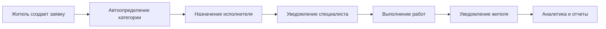

# 🚀 Qyzmeta-Bot — Революция в ЖКХ Казахстана

**Первая в Казахстане цифровая экосистема для жилищно-коммунального хозяйства**

[🎯 Попробовать бота](https://t.me/qyzmetabot) • [📞 Связаться с нами](#контакты) • [💼 Стать партнером](#партнерство)

---

## ✨ Что такое Qyzmeta-Bot?

**Qyzmeta-Bot** — это умный помощник в Telegram, который **упрощает жизнь** в многоквартирных домах и **автоматизирует работу** управляющих компаний. 

### 🏆 Главные преимущества

<table>
<tr>
<td width="50%">

#### 👥 **Для жильцов**
- 📱 **Одно касание** — создать заявку с фото
- 🔔 **Автоуведомления** о статусе ремонта  
- 📋 **История заявок** — вся информация в одном месте
- 🕐 **Работает 24/7** — подать заявку можно в любое время
- 🆓 **Абсолютно бесплатно** для жителей

</td>
<td width="50%">

#### 🏢 **Для управляющих компаний**
- ⚡ **Автоматизация 80%** рутинных процессов
- 📊 **Полная аналитика** работы с жителями
- 🎯 **Автораспределение** заявок исполнителям
- 💰 **Экономия до 200,000 ₸** в месяц на call-центре
- 📈 **Повышение качества** обслуживания

</td>
</tr>
</table>

---

## 🎯 Кому подойдет Qyzmeta-Bot?

### 🏠 **Управляющие компании**
- Автоматизируйте прием и обработку заявок от жителей
- Получите полную статистику работы своих специалистов  
- Снизьте нагрузку на диспетчеров в 5 раз
- Повысьте лояльность жителей за счет прозрачности

### 🔧 **Сервисные организации**
- Получайте заявки напрямую от жителей
- Автоматическое распределение по вашим специализациям
- Ведите учет выполненных работ
- Расширяйте клиентскую базу

### 🏘️ **ТСЖ и ОСИ**
- Упростите взаимодействие с жителями
- Контролируйте работу подрядчиков
- Ведите прозрачную отчетность
- Повысьте участие жителей в управлении домом

### 🏗️ **Застройщики**
- Предоставьте сервис жителям новых ЖК
- Снизьте количество жалоб
- Контролируйте устранение недостатков
- Повысьте имидж компании

---

## 🚀 Как это работает?

### Для жителей — Просто как 1-2-3!

| 1️⃣ **Открыть бота** | 2️⃣ **Создать заявку** | 3️⃣ **Отслеживать статус** |
|:---:|:---:|:---:|
| Найти @qyzmeta_bot в Telegram | Одно касание + фото проблемы | Автоматические уведомления |
|  |  |  |

### Для УК — Полная автоматизация!

---

## 💎 Крутые функции, которые понравятся всем

### 🎯 **Для жителей**

#### 📱 **Умные заявки**
- **Категории услуг**: Домофон 🔔, Электрика ⚡, Сантехника 🚿, Благоустройство 🌳
- **Фото и видео**: Прикрепите медиафайлы для точного описания проблемы
- **Геолокация**: Автоматическое определение вашего ЖК
- **История**: Все ваши заявки сохраняются навсегда

#### 🔔 **Умные уведомления**
- **Статус заявки**: Получайте обновления в реальном времени
- **Назначение исполнителя**: Узнайте, кто будет решать вашу проблему  
- **Завершение работ**: Подтверждение выполнения с фото
- **Оценка качества**: Оцените работу специалиста

#### 🏠 **Информация о доме**
- **Контакты УК**: Все номера телефонов в одном месте
- **Сервисные компании**: Список проверенных подрядчиков
- **Объявления**: Важная информация от управляющей компании
- **Соседи**: Доска объявлений для жителей

### 🏢 **Для управляющих компаний**

#### 📊 **Мощная аналитика**
- **Дашборд в реальном времени**: Количество активных заявок, время реакции
- **Отчеты по категориям**: Какие проблемы встречаются чаще всего
- **Рейтинг исполнителей**: Кто работает лучше, а кому нужна помощь
- **Трендовый анализ**: Предсказание пиковых нагрузок

#### 🎯 **Автоматизация процессов**
- **Умное распределение**: Заявки попадают к нужному специалисту автоматически
- **Контроль SLA**: Автоматические напоминания о просроченных заявках
- **Интеграция с CRM**: Синхронизация с вашими учетными системами
- **Мобильность**: Управляйте процессами из любой точки мира

#### 💼 **Управление персоналом**
- **Роли и права**: Настройте доступ для каждого сотрудника
- **Контроль качества**: Система оценок и обратной связи
- **Обучение**: Встроенные инструкции и база знаний
- **Мотивация**: Система рейтингов и поощрений

### 🔧 **Для сервисных организаций**

#### 🎪 **Панель поставщика услуг**
- **Автоматические заявки**: Получайте заказы по вашим специализациям
- **Календарь работ**: Планируйте свое время эффективно
- **Статистика доходов**: Отслеживайте финансовые результаты
- **Рейтинг и отзывы**: Строите репутацию качественного исполнителя

#### 🚀 **Рост бизнеса**
- **Новые клиенты**: Доступ к жителям множества ЖК
- **Автоматизация**: Меньше времени на поиск заказов, больше на работу
- **Прозрачность**: Честные условия сотрудничества
- **Поддержка**: Техническая помощь 24/7

---

## 🌟 Результаты наших клиентов

### 📈 **Впечатляющие цифры**

<table>
<tr>
<td align="center">
<h3>80%</h3>

снижение нагрузки на call-центр

</td>
<td align="center">
<h3>5x</h3>

ускорение обработки заявок

</td>
<td align="center">
<h3>95%</h3>

удовлетворенность жителей

</td>
<td align="center">
<h3>200k ₸</h3>

экономия в месяц для УК

</td>
</tr>
</table>

### 💬 **Отзывы клиентов**

> **"Раньше у нас было 50+ звонков в день. Теперь большинство заявок приходят через бота — и сразу к нужному специалисту!"**  
> *— Айгерим Смагулова, УК "Премиум Сервис"*

> **"Жители стали намного довольнее. Они видят весь процесс решения проблемы, и жалоб стало в разы меньше."**  
> *— Бакытжан Ербосынов, ТСЖ "Алатау Парк"*

> **"Как сервисная компания, мы получили доступ к новым клиентам. Заявки приходят стабильно, и мы можем планировать работу."**  
> *— Серик Казбеков, ТОО "ЭлектроМастер"*

---

## 💰 Тарифы и условия

<table>
<tr>
<th width="25%">🏠 <strong>Для жителей</strong></th>
<th width="25%">🏢 <strong>Базовый</strong></th>
<th width="25%">💼 <strong>Премиум</strong></th>
<th width="25%">🚀 <strong>Энтерпрайз</strong></th>
</tr>
<tr>
<td align="center">
<h3>БЕСПЛАТНО</h3>

навсегда

<ul align="left">
<li>✅ Создание заявок</li>
<li>✅ Отслеживание статуса</li>
<li>✅ История обращений</li>
<li>✅ Техподдержка</li>
</ul>
 
<strong>0 ₸ / месяц</strong>
</td>
<td align="center">
<h3>СТАРТ</h3>

до 100 квартир

<ul align="left">
<li>✅ Управление заявками</li>
<li>✅ Базовая аналитика</li>
<li>✅ 2 категории услуг</li>
<li>✅ Email поддержка</li>
</ul>
 
<strong>15,000 ₸ / месяц</strong>
</td>
<td align="center">
<h3>ПРОФИ</h3>

до 500 квартир

<ul align="left">
<li>✅ Все функции Базового</li>
<li>✅ Полная аналитика</li>
<li>✅ Все категории услуг</li>
<li>✅ Брендинг бота</li>
<li>✅ Телефон поддержка</li>
</ul>
 
<strong>35,000 ₸ / месяц</strong>
</td>
<td align="center">
<h3>МАКСИМУМ</h3>

безлимитно

<ul align="left">
<li>✅ Все функции Премиум</li>
<li>✅ API интеграции</li>
<li>✅ Кастомные функции</li>
<li>✅ Персональный менеджер</li>
<li>✅ SLA 99.9%</li>
</ul>
 
<strong>от 75,000 ₸ / месяц</strong>
</td>
</tr>
</table>

### 🎁 **Специальные предложения**

- **🆓 Бесплатный тест**: 30 дней бесплатно для любого тарифа
- **💰 Скидка 20%**: При оплате за год вперед
- **🏢 Корпоративные скидки**: Для сетей УК от 30%
- **🤝 Партнерская программа**: Приведи друга и получи бонус

---

## 🛠️ Техническая информация

### 🔧 **Архитектура системы**
- **🐍 Python 3.11+** — современный и быстрый язык
- **🤖 Aiogram 3.20** — самый популярный Telegram Bot фреймворк
- **🗄️ PostgreSQL** — надежная база данных
- **☁️ Cloud Ready** — готово к развертыванию в облаке

### 🔒 **Безопасность**
- **🔐 Шифрование данных** — все персональные данные защищены
- **🛡️ GDPR Compliance** — соответствие европейским стандартам
- **🔑 Двухфакторная аутентификация** — для администраторов
- **📊 Аудит действий** — полное логирование всех операций

### 📈 **Масштабируемость**
- **⚡ Асинхронная архитектура** — обработка тысяч запросов одновременно
- **🔄 Горизонтальное масштабирование** — добавление серверов по мере роста
- **💾 Кластерная БД** — высокая доступность данных
- **🌐 CDN интеграция** — быстрая загрузка медиафайлов

### 🔌 **Интеграции**
- **📧 Email системы** — отправка отчетов и уведомлений
- **📱 SMS шлюзы** — дублирование критичных уведомлений  
- **💳 Платежные системы** — Kaspi Pay, Halyk Bank
- **📊 CRM системы** — 1C, Битрикс24, AmoCRM

---

## 🚀 Начать использовать прямо сейчас!

### Для жителей — 2 простых шага:

1. **Найдите бота**: Перейдите по ссылке [@qyzmetabot](https://t.me/qyzmetabot)
2. **Зарегистрируйтесь**: Укажите свой ЖК и номер квартиры

### Для УК — Бесплатное подключение:

1. **Заявка на подключение**: Заполните форму ниже или позвоните
2. **Техническая настройка**: Наши специалисты все настроят за вас
3. **Обучение персонала**: Проведем обучение ваших сотрудников  
4. **Запуск и поддержка**: Поможем на каждом этапе

### 📞 **Получить консультацию**

<table>
<tr>
<td width="50%" align="center">
<h4>🏢 <strong>Для управляющих компаний</strong></h4>

📞 <strong>+7 (727) 123-45-67</strong> 
📧 <strong>uk@softmontazh.kz</strong> 
💬 <strong>@qyzmeta_uk_manager</strong>

 
<a href="https://qyzmeta.softmontazh.kz/uk-form" style="background-color: #2E86AB; color: white; padding: 12px 24px; text-decoration: none; border-radius: 6px; font-weight: bold;">📝 ЗАПОЛНИТЬ ЗАЯВКУ</a>
</td>
<td width="50%" align="center">
<h4>🔧 <strong>Для сервисных организаций</strong></h4>

📞 <strong>+7 (777) 987-65-43</strong> 
📧 <strong>service@softmontazh.kz</strong> 
💬 <strong>@qyzmeta_service_manager</strong>

 
<a href="https://qyzmeta.softmontazh.kz/service-form" style="background-color: #4CAF50; color: white; padding: 12px 24px; text-decoration: none; border-radius: 6px; font-weight: bold;">🤝 СТАТЬ ПАРТНЕРОМ</a>
</td>
</tr>
</table>

---

## 🤝 Партнерство

### 💼 **Станьте нашим партнером**

Мы всегда открыты для сотрудничества:

#### 🏢 **Региональные партнеры**
- Представляйте Qyzmeta-Bot в вашем регионе
- Получайте комиссию с каждого клиента  
- Полная маркетинговая поддержка
- Обучение продажам и технической поддержке

#### 🔧 **Технологические партнеры**
- Интеграция с вашими системами
- Совместная разработка решений
- Техническая экспертиза  
- Совместный выход на рынок

#### 💰 **Инвестиционные возможности**
- Участие в развитии платформы
- Доходность от роста рынка ЖКХ
- Социально значимый проект
- ESG инвестиции

---

## 📍 Контакты

### 🏢 **LLP Softmontazh**

<table>
<tr>
<td width="33%" align="center">
<h4>🏢 <strong>Главный офис</strong></h4>

г. Алматы, ул. Абая 150/230 
БЦ "Esentai Tower", 34 этаж 
📍 <a href="https://maps.google.com/?q=Almaty+Esentai+Tower">Показать на карте</a>

</td>
<td width="33%" align="center">
<h4>📞 <strong>Телефоны</strong></h4>

<strong>Продажи:</strong> +7 (727) 123-45-67 
<strong>Поддержка:</strong> +7 (777) 987-65-43 
<strong>Партнерство:</strong> +7 (705) 555-12-34

</td>
<td width="33%" align="center">
<h4>🌐 <strong>Онлайн</strong></h4>

<strong>Сайт:</strong> <a href="https://qyzmeta.softmontazh.kz">qyzmeta.softmontazh.kz</a> 
<strong>Email:</strong> info@softmontazh.kz 
<strong>Telegram:</strong> @softmontazh_support

</td>
</tr>
</table>

### 📱 **Социальные сети**

### 🕐 **Время работы**

**Офис:** Пн-Пт 9:00-18:00 (GMT+6)  
**Техподдержка:** 24/7 через Telegram  
**Консультации:** Пн-Сб 8:00-20:00

---

## 🌟 Присоединяйтесь к цифровой революции ЖКХ!

**Qyzmeta-Bot** — это не просто бот, это **будущее управления недвижимостью в Казахстане.**

Начните пользоваться уже сегодня и почувствуйте разницу!

---

*© 2025 LLP Softmontazh. Все права защищены.  
Сделано с ❤️ в Казахстане для Казахстана.*

